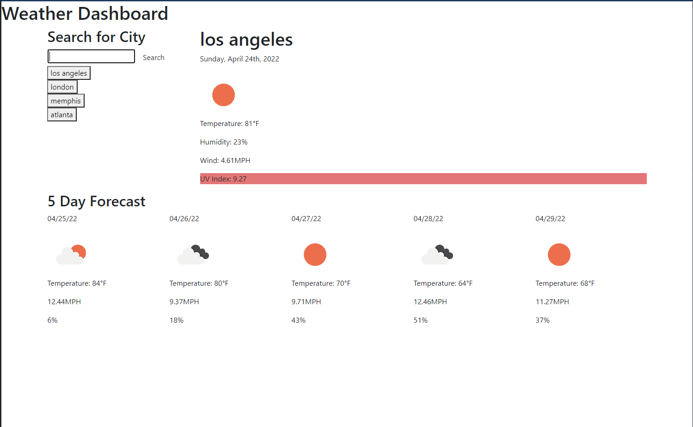

# Weather Dashboard

A simple weather dashboard that allows users to search for a city and see the current weather conditions and a forecast for the next 5 days. Their searches are saved to local storage and their search history is rendered below the search bar.

## Installation and Usage

The site is deployed to GitHub pages and can be viewed here:
https://noahneville.github.io/weather-dashboard/

Alternatively, you can clone this repo and run it locally on your machine.

To use this app, simply search for a city in the search field. 

## Demo 

## License

MIT

## Acknowledgements

Thanks to my tutor, Dan Ringenbach.
